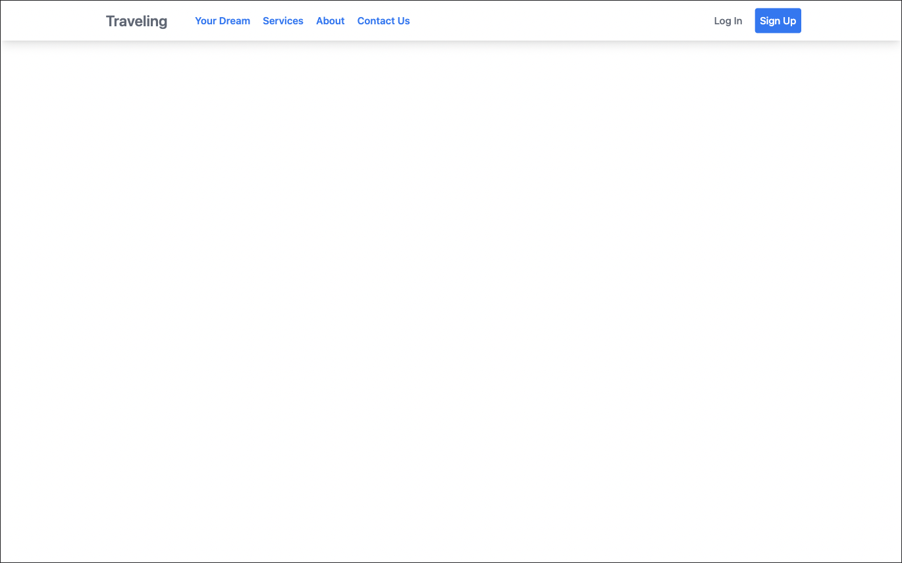

## ✈️ Simple React Project (Vite + Tailwind)

## Basic Overview

This simple travel (site) prototype shows how React with Typescript, Vite and Tailwind can be used to build a friendly user experience.

#### Features (in progress)

- Sign up
- Login
- Your Dream view: shopping cards and posters about travel
- Services: Hotel, Tickets, Tips
- About
- Contact Us

#### Timeline prints (continuous evolution)



## Build/Run

#### Requirements

- Node.js
- NPM

```javascript

/* First, Install the needed packages */
npm install

/* Then start the React app */
npm start

/* To run the tests */
npm run test

```

## Step by Step 

[ViteJS](https://vitejs.dev/guide/) and [React](https://react.dev/) + [Typescript](https://www.typescriptlang.org/)

```javascript
npm create vite@latest

/* ✔ Project name: … traveling */
/* ✔ Select a framework: › React */
/* ✔ Select a variant: › TypeScript */

cd traveling
npm install
npm run dev
```

[Tailwind](https://tailwindcss.com/docs/guides/vite)

```javascript
npm install -D tailwindcss postcss autoprefixer
npx tailwindcss init -p
```

[Router](https://reactrouter.com/en/main)

```javascript
npm install react-router-dom
```

<br/>

<p align="center">
<sub>A simple study project by <a href="https://www.barroso.dev/">Francisco Barroso</a></sub>
</p>